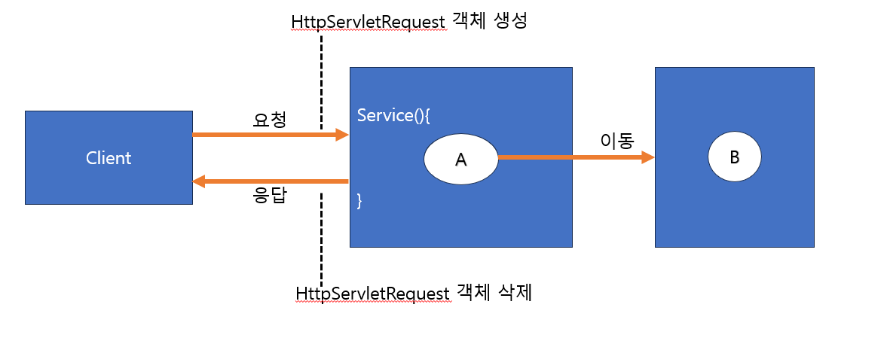

# Servlet(6)_HttpServlet요청_재지정.

### 6-6. HttpServletRequest

- `HttpServlet` 객체는 클라이언트로부터 실행 요청이 들어올 떄마다 서블릿의 `service()` 메소드가 실행되기 전에 자동으로 생성되고, service() 메소드가 종료되면 자동으로 소멸 되는 객체이다.
- 따라서 `HttpServletRequest` 객체는 하나의 서블릿 페이지가 실행되는 동안에만 메모리이다.
- `HttpServletRequest`를 통해 페이지 간 데이터를 전달하는 방법은 페이지를 이동하기 전에 `HttpServletRequest` 객체에 정보를 등록한 후, 이동하여 이동한 페이지에서 전달받은 `HttpServletRequest`에 저장된 정보를 추출해서 사용한다

- `HttpServletRequesst` 객체를 통한 정보 공유는 동일한 요청에서 실행된 페이지끼리만 이루어진다.
- 요청재지정 : 클라이언트가 요청한 페이지가 실행되다가 다른 페이지로 이동하는 것을 의미함.
- `**RequestDispatcher`** 은 서블릿 컨테이너 내에서 다른 서블릿으로 요청을 전달하는 객체이다.
    - **forward()**:  클라이언트의 요청으로 생성되는 `Request`와 `Response` 객체를 다른 자원에 전달하고 수행 제어를 완전히 넘겨서 다른 자원의 수행 결과를 클라이언트로 응답하도록 하는 기능의 메소드이다.
    - **include()**: 클라이언트의 요청으로 생성되는 `Request`와 `Response` 객체를 다른 자원에 전달하고 수행한 다음, 그 결과를 클라이어늩에서 요청한 서블릿 내에 포함하여 클라이언트로 응답한다.
        - 다른 자원의 출력을 현재 응답에 포함시킵니다. **`include`** 메소드는 호출된 자원이 현재 응답 스트림에 콘텐츠를 추가할 수 있게 해준다.

### 6-7. HttpServletResponse 요청 재지정

- `HttpServletResponse`에서는 다른 웹 애플리케이션의 파일이나 다른 웹서버의 자원으로 요청을 재지정할 수 있다.
- 이는 클라이언트에게 특정 동작을 지시하기 때문에 가능하다.
- **리다이렉트 (Redirect):** **`HttpServletResponse.sendRedirect(String url)`** 메소드를 사용하면, 클라이언트(웹 브라우저)에게 새로운 URL로 이동하라는 지시를 보낼 수 있다.  이때, 지정된 URL은 현재 웹 애플리케이션, 동일한 서버, 또는 완전히 다른 서버에 위치할 수 있다.