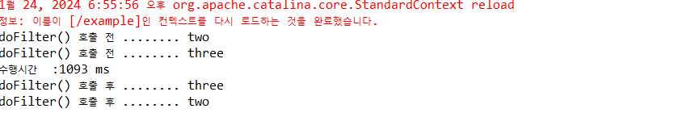

# Servlet(7)_Servlet_필터_등록_매핑_실행

## 7. 필터

- 필터는 클라이언트로부터 서블릿이 요청되어 수행될 때 필터링 기능을 제공하기 위한 기술이다.
- 필터가 수행되는 시점은 요청된 서블릿 수행되기 전과 후이다. 이를 이용하여 서블릿의 처리와 유지 보수를 더욱 효과적으로 처리할 수 있다.

### 7-1. 필터 개요

- 필터기능은 서블릿과 별도의 객체로 분리해야 하며, javax.servlet.Filter를 상속 받는다.
- 필터가 어떤 페이지를 필터링하는지 웹서버에 설정한다. 그러면 필터링이 설정된 페이지가 클라이언트로부터 요청될 때 자동으로 실행되어 클라이언트는 필터가 존재하는지 알지 못한다.
- 필터로 구현할 수 있는 기능 목록
    - 서블릿이 호출되기 전에 서블릿 요청을 가로채는 기능
    - 서블릿이 호출되기 전에 요청 내용을 점검하는 기능
    - 요청/응답 헤더의 수정과 조정 기능
    - 서블릿이 호출된 후에 서블릿 응답을 가로채는 기능
    - 로그기록과 한글처리

### 7-2. 필터 구현

- init(FilterConfig)
    - 필터 객체가 생성될 때 호출되는 메소드이다. 서버가 시작될 때 한번만 호출된다.
- destory()
    - 필터 객체가 삭제될 때 호출되는 메소드이다. 따라서 destory()에는 자원해제 기능을 구현한다.
- doFilter(SErvletRequest, ServletResponse, FilterChain)
    - 필터링 설정한 서블릿을 실핼할 때마다 호출되는 메소드로서 실제 필터링 기능을 구현하는 메소드이다.

### 7-3. 필터 등록 : <filter> 태그

- 클래스가 com.example 내에 위치한다고 하였을 때 filter태를 설정하는 방법은 아래와 같다.

```
#구현
<filter>
  	<filter-name>flow1</filter-name>
  	<filter-class>Filter.FlowFilterOne</filter-class>
  </filter>
  <filter>
  	<filter-name>flow2</filter-name>
  	<filter-class>Filter.FlowFilterTwo</filter-class>
  </filter>
```

```
//양식
<filter>
        <filter-name>MyFilter</filter-name>
        <filter-class>com.example.MyFilter</filter-class>
        <!-- 필터 초기화 파라미터 설정 -->
        <init-param>
            <param-name>myParam</param-name>
            <param-value>MyParameterValue</param-value>
        </init-param>
</filter>
```


- web.xml에 <filter>태그로 등록하면 필터 객체는 웹 애플리케이션 서비스가 시작될 때 객체가 생성되어 실행 준비를 완료한다.

### 7-4. 필터 매핑 : <filter-mapping> 태그

- 필터 객체는 클라이언트가 필터링 설정한 서블릿을 요청할 때만 실행된다.
- 필터들이 어떤 서블릿을 필터링할 것인지 그 대상을 설정하는 일이다.

```
# 구현
<filter-mapping>
        <filter-name>flow1</filter-name>
        <url-pattern>/second</url-pattern>
  </filter-mapping>
  
  <filter-mapping>
        <filter-name>flow2</filter-name>
        <url-pattern>/*</url-pattern>
  </filter-mapping>
```

```
// 양식
<filter-mapping>
        <filter-name>MyFilter</filter-name>
        <!-- 필터가 적용될 URL 패턴 설정 -->
        <url-pattern>/*</url-pattern>
    </filter-mapping>
```

### 7-5. 필터 실행


- 실행순서
    1.  /second 서블릿을 실행시키면 클라이언트부터 요청이 web.xml의 <url-pattern>/second</url-pattern>에 만족하여 flow1 필터의 doFilter() 메소드가 실행된다.
    2.  <url-pattern>/*</url-pattern>에도 만족하기 때문에 flow2필터의 doFilter()의 메소드가 실행된다.
    3. web.xml에 더 이상 조건에 만족하는 <filter-mapping>이 없다. 그러면 클라이언트가 요청한 서블릿이 실행된다.
- chain 변수는 doFilter()의 세 번째 인자이다. FilterChain 객체는 web.xml 파일에서 모든 <filter-mapping> 태그에 관한 정보를 가지고 있다. 따라서 서블릿이 실행될 때 처리 흐름을 제어할 수 있는 객체이다.
- @WebFilter()를 통해 매핑이 가능하다.
    
    ```java
    //초기 파라미터 설정 밥ㅇ법
    @WebFilter(
    	urlPatterns = "/*",
    	initParams = @WebInitParam(name="en", value= "UTF-8")
    )
    ```
    
    
    

## 8. 리스너

- event가 발생하기 기다리다 event가 발생하였을 때 수행되는 메소드이다.
- 이런 객체를 이벤트 핸들러라고 한다.
- 서블릿에서는 클라이언트 요청 전달, 요청 끝, 세션 객체 생성, 삭제, 서블릿 컨테이너 시작, 종료 등의 시점에서 사용한다.

### 8-1. 리스너 용어

- 이벤트 : 트리거와 같은 액션들
- 리스너 : 이벤트가 발생했을 때 호출되어 실행되는 메소드들이 정의되어 있는 객체.
- 이벤트 소스 : 이벤트가 발생하는 곳 ex) 버튼
- 웹에서의 이벤트 소스 : ServletContext, HttpSession, httpServletRequest 등에서 서블릿 API에서는 이벤트가 발생하면 자동으로 호출될 메소드들을 가지고 있는 리스너를 제공한다.
- 객체 생성과 삭제 이벤트